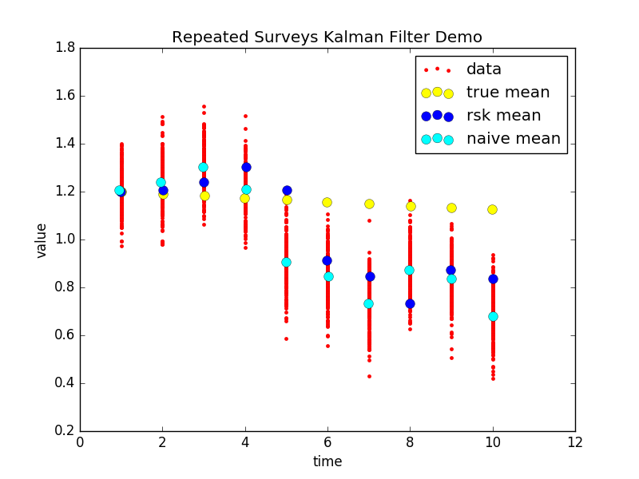
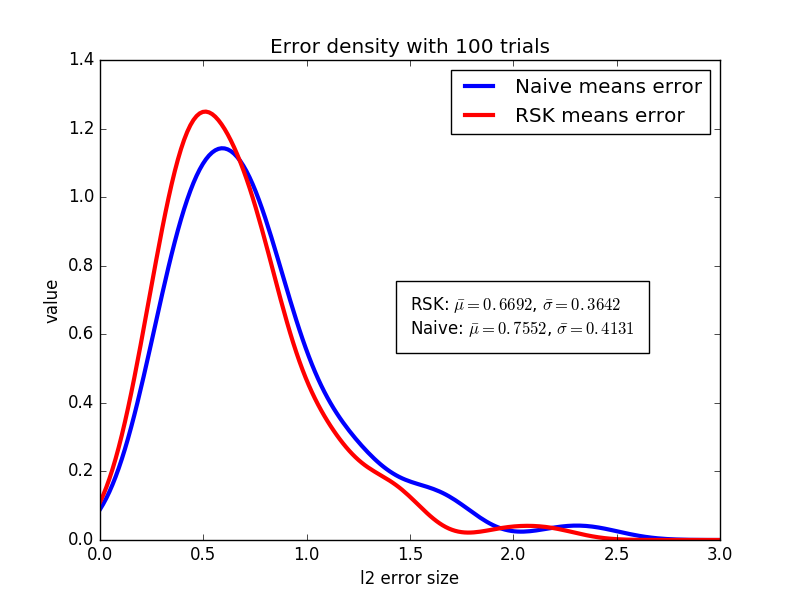

#Repeated Suvery Kalman Filter (RSK)
This project implements the repeated surveys Kalman filter of Jo Thori Lind found in the papers [here](http://folk.uio.no/jlind/papers/DP333.pdf) and [here](http://folk.uio.no/jlind/papers/surveys.pdf).  
It is based on the author's original source written for the Ox language.

## Overview
Suppose we observe a population of individuals at several points in time.  At each point in time, we can measure the mean of a variable of interest in the population.  But if the true mean of the population is changing smoothly and gradually over time, we might imagine that the measurement of a mean at any particular point in time might be improved by considering data from the other observed time slices.  This is the idea behind the Kalman filter--exploit the temporal dynamics to smooth out fluctuations in point-in-time estimates.

 

See [examples](examples/) for further illustration and applications of the Kalman filter.

## Setup
Installation requires numpy and scipy.  Clone the repo and then run the setup script
```bash
git clone https://github.com/rwalk/rsk
cd rsk
python setup.py install
```
Once the project has stabilized, we'll probably put it up on pypi to make it pip installable.

## Tests
We have a few tests that check the results of our python implementation against the original Ox implementation.
To run these tests, from the root of the project execute:

```bash
python -m unittest
```

## Working with cross sectional time series data
Because panel data/cross sectional time series data can be quite tricky to manage, we've implemented the `PanelSeries` interface to streamline computation
with the RSK filter.  There are several ways to use `PanelSeries`.  

### From a pandas DataFrame
To use a [Pandas DataFrames](http://pandas.pydata.org/pandas-docs/stable/) with the RSK model, we need to convert it to a `PanelSeries`.  For this, `PanelSeries` offers a simple `from_df` method:
```python
import pandas as pd
import scipy as sp
import random
from rsk import RSK
from rsk.panel import PanelSeries

#  Imagine we survey residents of Endor and ask them to estimate the number of Ewoks and the number of Rebels present
#  in their region.
data = [
    ["0", "Eastern Territory of Endor", 2, 1],
    ["0", "Eastern Territory of Endor", 0, 23],
    ["0", "Eastern Territory of Endor", 5, -19],
    ["0", "Western Territory of Endor", 1, 1],
    ["0", "Western Territory of Endor", -1, 2],
    ["0", "Western Territory of Endor", 8,9],
    ["1", "Eastern Territory of Endor", 1,0],
    ["1", "Eastern Territory of Endor", 0, 22],
    ["1", "Eastern Territory of Endor", 4, -17],
    ["1", "Western Territory of Endor", 2,0],
    ["1", "Western Territory of Endor", 0,0],
    ["1", "Western Territory of Endor", 7,10]
]

# order of the rows in the data frame doesn't matter...
random.shuffle(data)
df = pd.DataFrame.from_records(data, columns=["time", "region", "ewoks", "rebels"])

# specify the time and group variable names, as well as the names of the numeric columns to which we want to apply the RSK filter
panel_series = PanelSeries.from_df(data, "time", "region", "ewoks", "rebels")

# apply RSK filtering
# this example has 2 variables "rebels" and "ewoks" and two groups "Western" and "Eastern". So we are computing four filtered means
# If we apply a random walk, then n_alpha=4 so that each each mean can evolve according to a_i[t+1] = a_i[t] + e
translation_matrix = sp.eye(4)
transition_matrix = sp.eye(4)
a0 = 0.0001*sp.ones((4,1))
Q0 = 0.001*sp.eye(4)
rsk = RSK(transition_matrix, translation_matrix)
fitted_means = rsk.fit_em(panel_series, a0, Q0)
print(fitted_means)
```

### From a CSV 
The time and group indices specify the index of the column in the csv for the time and group identifier
variables. In this case `jedi.csv` should look like this:
```
time,region,ewoks,rebels
0,Eastern Territory of Endor,2,1
0,Eastern Territory of Endor,0,23
0,Eastern Territory of Endor,5,-19
0,Western Territory of Endor,1,1
0,Western Territory of Endor,-1,2
0,Western Territory of Endor,8,9
1,Eastern Territory of Endor,1,0
1,Eastern Territory of Endor,0,22
1,Eastern Territory of Endor,4,-17
1,Western Territory of Endor,2,0
1,Western Territory of Endor,0,0
1,Western Territory of Endor,7,10
```
To create a `PanelSeries` from this file:
```python
from rsk.panel import PanelSeries
time_index, group_index = 0,1
panel_series = PanelSeries.from_csv("jedi.csv", time_index, group_index, header=True)
```
All variables except for the group and time identifiers must be numeric.  


## Usage guide

The RSK filter is implemented in the RSK class. Initialize the class with the transition and translation matrices:
```python
from rsk import RSK
rsk_filter = RSK(transition_matrix, translation_matrix)
```
The transition matrix is an `n_alpha` by `n_alpha` array modelling the transition dynamics of the latent alpha vector.
The translation matrix is an `n_vars` by `n_alpha` array mapping the latent vector `alpha` back into fitted sample means.

To apply the repeated surveys Kalman filter, call the `fit` method on an RSK instance, passing in a PanelSeries object:
```python
fitted_means = rsk_filter.fit(panel_series, a0, Q0, Q, sigma=None)
```

In most cases, `Q` and `sigma` are unknown and will need to be estimated. In this case, use the `fit_em` method
```python
fitted_means, sigma = rsk_filter.fit_em(panel_series, a0, Q0, sigma0)
```
This method runs the EM algorithm developed by Lind. When working with `fit_em`, the algorithm may sometimes fail to converege.
When this happens, using a smaller `Q0` may help.

The resulting `fitted_means` object from `fit` and `fit_em` is an `n_periods` by `n_vars` matrix containing the means estimated by the RSK algorithm. After `fit` has been applied, the `rsk.alpha` vector and other fitted parameters become available as attributes of the RSK
 instance. 

## Notation guide

| Variable      | Code          | Description  |
| :------------- |:-------------| :-----|
|T|n_periods|Number of point in time measurements|
|N|n_individuals|Number of individuals|
|m|n_vars|Number of observed variables per individual per time slice|
|n|n_alpha|Length of the α vector|
|F|transition_matrix|Markov transition matrix|
|Z|translation_matrix|Translates α into group means μ|
